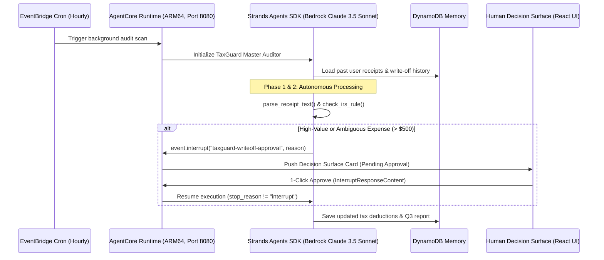

# TaxGuard — Agents for Humans

> **Autonomous Background Tax & Receipt Auditor for Freelancers & Small Business Owners**  
> *Submitted to the AWS & Devpost "Agents for Humans" Hackathon*  
> **Track:** Everyday Agents / Professional Agents

---

## 🌟 Overview

TaxGuard is an autonomous background AI agent built with the **Strands Agents SDK** and deployed on **Amazon Bedrock AgentCore**. It solves a painful, universal problem for freelancers and solo entrepreneurs: *missed tax deductions and mind-numbing receipt categorization.*

Unlike conversational chat-bots that require constant hand-holding, TaxGuard runs silently in the background via hourly cron triggers, processes receipts, checks IRS Schedule C rules, remembers past user behavior via Amazon DynamoDB, and **pauses via the Strands Interrupt API (`BeforeToolCallEvent`) only when human judgment is truly required.**

---

## 🏗️ Architecture & Flow (Mermaid Diagram)



---

## 🚀 Key Features

1. **Autonomous Background Cron Trigger**: Wakes hourly without manual user intervention.
2. **Strands `@tool` Decorators**: Specialized OCR parsing and IRS Schedule C rule verification.
3. **Human-in-the-Loop Interrupt API**: Uses `BeforeToolCallEvent` and `event.interrupt()` to pause execution on ambiguous expenses, requiring exactly 1 click from the user.
4. **Persistent Memory**: DynamoDB backend for long-term user context and receipt history.
5. **Interactive Self-Running Demo & Command Center**: Built with React, Vite, TypeScript, Tailwind CSS, and Framer Motion, featuring bilingual support (English & Bahasa Indonesia).

---

## 🛠️ Local Installation & Development

To run the interactive command center and web demo locally:

```bash
# 1. Clone repository
git clone https://github.com/<username>/taxguard-agents-for-humans.git
cd taxguard-agents-for-humans

# 2. Install frontend dependencies
npm install

# 3. Start development server
npm run dev
```

To test the Python backend interrupt hook locally:
```bash
python test_interrupt.py
```

---

## 🚢 Deployment (Vercel & AWS AgentCore)

- **Frontend (Web Demo):** Deployable instantly to Vercel with zero environment variables required.
- **Backend (AgentCore):** Packaged for ARM64 (`linux/arm64`) on port 8080 with mandatory `/invocations` (POST) and `/ping` (GET) endpoints. Deploy via AWS AgentCore Starter Toolkit:
  ```bash
  agentcore launch --platform linux/arm64
  ```

---

## 📄 License

This project is open source and licensed under the **MIT License** (see the [LICENSE](LICENSE) file).
